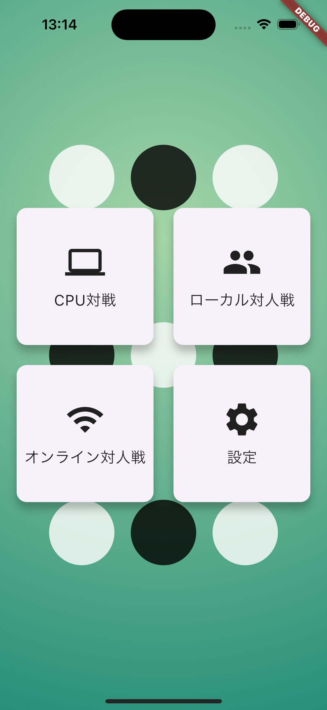
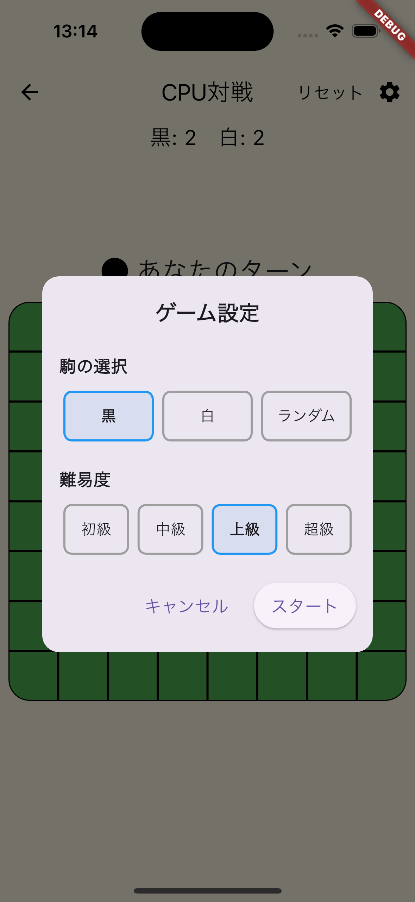
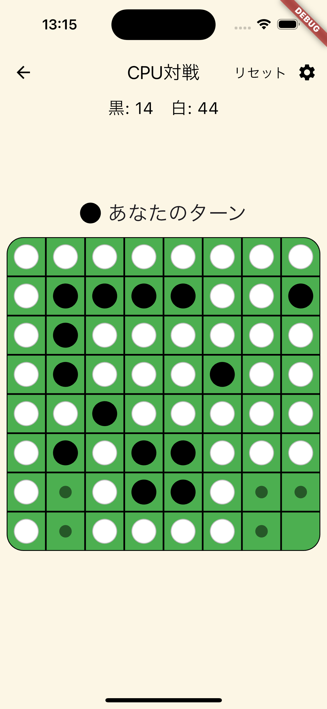

# リバーシ (オセロ) アプリ

Flutter製のリバーシ（オセロ）ゲームアプリです。

## 基本情報

シンプルで直感的なFlutterベースのオセロ（リバーシ）ゲームアプリケーションです。



### 主な機能

- 8×8のオセロゲームボード
- 黒と白の石の自動反転
- 有効な手の視覚的表示
- スコアのリアルタイム表示
- ゲームリセット機能
- ローカル対人戦モード
- CPUとの対戦モード（初級・中級・上級・超級の難易度レベル設定）
- オンライン対戦モード（計画中）

### 技術スタック

- Flutter 3.29.2
- Dart 3.7.2
- hooks_riverpod: 状態管理
- go_router: ルーティング
- freezed: イミュータブルデータクラス生成

## インストール手順

### 前提条件

- Flutter SDKがインストールされていること
- Dart SDKがインストールされていること
- AndroidまたはiOSの開発環境が設定されていること

### セットアップ

```bash
# リポジトリをクローン
git clone git@github.com:AimotoRyosuke/reversi_app.git

# プロジェクトディレクトリに移動
cd reversi_app

# 依存関係をインストール
flutter pub get

# アプリを実行
flutter run
```

## 使用方法

### ゲームの基本ルール

1. 黒が先手、白が後手です
2. 自分の石を相手の石で挟むと、挟まれた石が自分の色に変わります
3. 相手の石を1つ以上ひっくり返せる場所にしか石を置けません
4. 全てのマスが埋まるか、両者とも置けなくなったらゲーム終了です
5. より多くの石を獲得したプレーヤーの勝ちです

### アプリ操作方法

- 半透明のマーカーで表示された有効なマスをタップして石を配置します
- 画面上部の「リセット」ボタンでゲームをいつでもリセットできます
- 現在のスコアと手番は画面上部に表示されます
- 配置することができないときは自動でターンをスキップし画面に「スキップ」と表示されます

## プロジェクト構造

```tree
lib/
├── constants.dart                              # 定数定義
├── game/                                       # ゲームロジック
│   ├── reversi_ai.dart                         # CPUロジック
│   └── reversi_logic.dart                      # リバーシのコアロジック
├── main.dart                                   # エントリーポイント
├── routes.dart                                 # ルーティング設定
├── ui/                                         # UI関連
│   ├── components/                             # UIコンポーネント
│   │   ├── game_board.dart                     # ゲームボード
│   │   ├── score.dart                          # スコア表示
│   │   ├── skip_message.dart                   # スキップメッセージ
│   │   ├── top_screen_background_painter.dart  # トップ画面の背景描画
│   │   └── winner_dialog.dart                  # 勝者ダイアログ
│   ├── match_cpu_screen.dart                   # CPU対戦画面
│   ├── match_local_screen.dart                 # ローカル対戦画面
│   └── top_screen.dart                         # トップ画面
└── view_model/                                 # ビューモデル
    ├── match_cpu_view_model.dart               # CPU対戦ビューモデル
    ├── match_local_view_model.dart             # ローカル対戦ビューモデル
```

## 開発ガイド

### コーディング規約

- コードは一貫性を保つために、プロジェクトのスタイルガイドに従ってください。
- 変数名、関数名、クラス名は意味のある名前を付けてください。
- コメントは必要に応じて追加し、コードの意図を明確にしてください。

### ブランチ戦略

- `main` ブランチは常にリリース可能な状態を保ちます。
- 新しい機能や修正は `feature/` または `bugfix/` ブランチで行います。
- 作業が完了したら、プルリクエストを作成してレビューを依頼します。

### コードレビュー

- プルリクエストは少なくとも1人の他の開発者によってレビューされる必要があります。
- レビューアはコードの品質、スタイル、パフォーマンス、セキュリティを確認します。

## トラブルシューティング

### よくある問題

- **依存関係の問題**: `flutter pub get` を実行して依存関係を更新してください。
- **ビルドエラー**: エラーメッセージを確認し、必要な修正を行ってください。
- **実行時エラー**: デバッグモードでアプリを実行し、エラーログを確認してください。

### サポート

- 問題が解決しない場合は、[issue tracker](https://github.com/AimotoRyosuke/reversi_app/issues) に問題を報告してください。
- その他の質問やサポートが必要な場合は、プロジェクトのメンテナーに連絡してください。

## 将来の展望

優先度順に以下の機能を実装していく予定です：

### 優先度高（短期実装予定）

- ヒント機能（最適な手や可能な手の評価値を表示）
- ターン巻き戻し/やり直し機能（学習目的や練習用）
- チュートリアルモード
- サウンドエフェクトとBGMの追加

### 優先度中（中期実装予定）

- 統計情報（プレイヤーの勝率、平均獲得石数、最高スコアなどの表示）
- ゲームプレイ履歴の保存と再生機能
- 対戦履歴と分析機能（過去の対戦を保存し、戦略分析を提供）
- カスタマイズ可能なテーマと石のデザイン

### 優先度低（長期実装予定）

- 対人オンライン対戦モードの実装
- 対戦マッチング機能（ランダムマッチングと友達とのプライベートマッチ）
- ハイスコアおよびランキング機能

## コマンドラインリファレンス

```bash
# プロジェクトをクリーン
flutter clean

# 依存関係の更新
flutter pub upgrade

# デバッグモードで実行
flutter run

# 特定のデバイスで実行
flutter run -d <device_id>

# リリースモードで実行
flutter run --release

# テストの実行
flutter test

# コード解析
flutter analyze
```

---

**注意**: このREADMEはプロジェクトの現状を反映しています。実際の機能や実装は変更される可能性があります。
